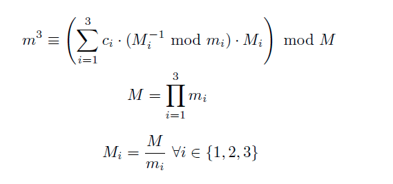

# Intro to Crypto 3

## Information
Category: Crypto   
Difficulty: Baby   
Author: black-simon   
First Blood: BoredPerson   
Description:   

After a new potentially deadly disease first occurring in Wuhan, China, the Chinese Corona Response Team sends messages to the remainder of the world.
However, to avoid disturbing the population, they send out this message encrypted. We have intercepted all messages sent by the Chinese government and
provide you with the public keys found on the governments' website. Please, find out if we are all going to die!   

## Solution
Doing some research, the scenario at hand can be exploited using the Chinese Remainer Theorem. The following formular lets us compute m cubed using this special theorem.




Having m cubed will easily let us find m which should be the message. 

The following python code implements this and gives us the orignal message:    

```python
#!/usr/bin/python
import os
import math
from Crypto.Util.number import long_to_bytes
import gmpy2 as gmpy2


os.system("openssl rsa -pubin -in ../resources/german_government.pem -text -noout > ../translation/pk_ge.txt")
os.system("openssl rsa -pubin -in ../resources/us_government.pem -text -noout > ../translation/pk_us.txt")
os.system("openssl rsa -pubin -in ../resources/russian_government.pem -text -noout > ../translation/pk_ru.txt")

file_ge = open("../translation/pk_ge.txt", "r")
file_us = open("../translation/pk_us.txt", "r")
file_ru = open("../translation/pk_ru.txt", "r")

#modulo parsing
file_ge.readline()
file_ru.readline()
file_us.readline()

file_ge.readline()
file_ru.readline()
file_us.readline()

n1 = int(file_ge.read().split("E")[0].replace('\n', '').replace(' ', '').replace(':', ''), 16)
n2 = int(file_us.read().split("E")[0].replace('\n', '').replace(' ', '').replace(':', ''), 16)
n3 = int(file_ru.read().split("E")[0].replace('\n', '').replace(' ', '').replace(':', ''), 16)

e = 3

c1 = 3999545484320691620582760666106855727053549021662410570083429799334896462058097237449452993493720397790227435476345796746350169898032571754431738796344192821893497314910675156060408828511224220581582267651003911249219982138536071681121746144489861384682069580518366312319281158322907487188395349879852550922320727712516788080905540183885824808830769333571423141968760237964225240345978930859865816046424226809982967625093916471686949351836460279672029156397296634161792608413714942060302950192875262254161154196090187563688426890555569975685998994856798884592116345112968858442266655851601596662913782292282171174885
c2 = 7156090217741040585758955899433965707162947606350521948050112381514262664247963697650055668324095568121356193295269338497644168513453950802075729741157428606617001908718212348868412342224351012838448314953813036299391241983248160741119053639242636496528707303681650997650419095909359735261506378554601448197330047261478549324349224272907044375254024488417128064991560328424530705840832289740420282298553780466036967138660308477595702475699772675652723918837801775022118361119700350026576279867546392616677468749480023097012345473460622347587495191385237437474584054083447681853670339780383259673339144195425181149815
c3 = 9343715678106945233699669787842699250821452729365496523062308278114178149719235923445953522128410659220617418971359137459068077630717894445019972202645078435758918557351185577871693207368250243507266991929090173200996910881754217374691865096976051997491208921880703490275111904577396998775470664002942232492755888378994040358902392803421017545356248082413409915177589953816030273082416979477368273328755386893089597798104163894528521114946660635364704437632205696975201216810929650384600357902888251066301913255240181601332549134854827134537709002733583099558377965114809251454424800517166814936432579406541946707525

N = n1*n2*n3
N1 = N//n1
N2 = N//n2
N3 = N//n3

u1 = gmpy2.invert(N1, n1)
u2 = gmpy2.invert(N2, n2)
u3 = gmpy2.invert(N3, n3)

M = (c1*u1*N1 + c2*u2*N2 + c3*u3*N3) % N

m = int(gmpy2.iroot(M,e)[0])

print(long_to_bytes(m))
```

flag: CSCG{ch1nes3_g0vernm3nt_h4s_n0_pr0blem_w1th_c0ron4}

## Prevention

Fixing the security flaw at hand could involve picking higher encryption exponents as well as to conduct random padding.