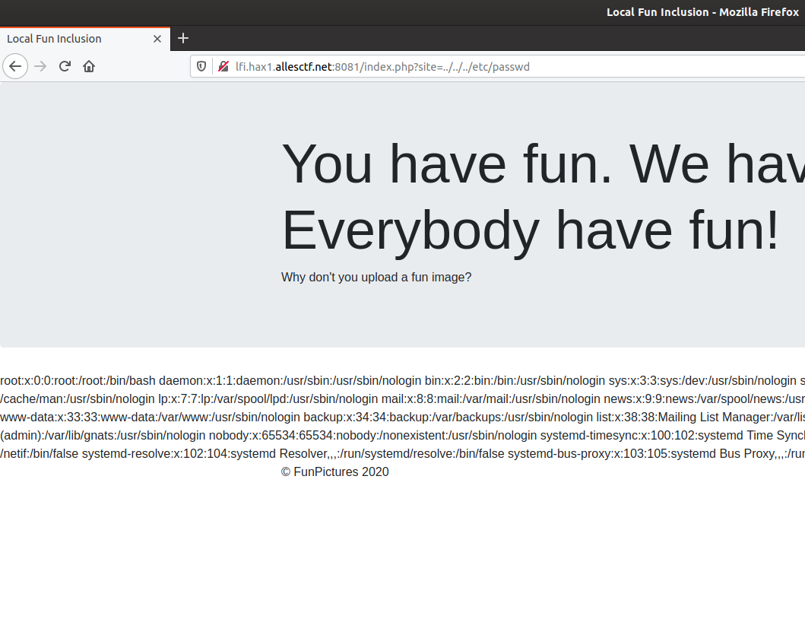
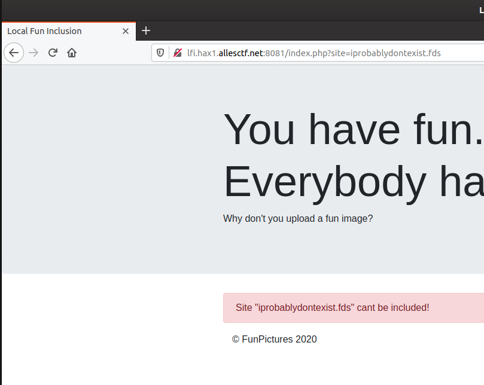
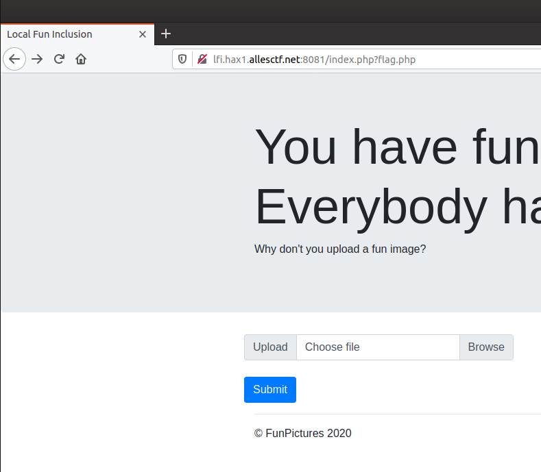
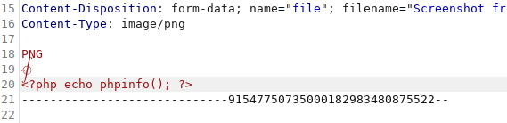
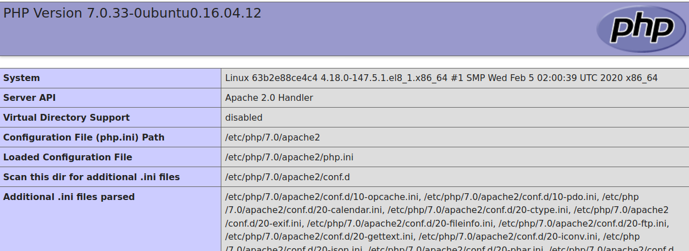
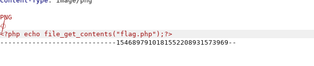
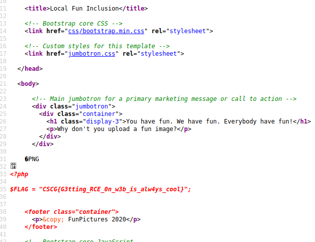

# local fun inclusion

## Information
Category: Web   
Difficulty: Easy   
Author: 0x4d5a   
First Blood: BoredPerson   
Description: 
Recently i learned how to code in PHP. There are cool tutorials for file uploads around! Imgur Memes have no chance vs. my cool image sharing website!   

Check it out at: http://lfi.hax1.allesctf.net:8081/   

## Solution
The name and description of this challange hints, that a local file inclusion is possible. Also, we are able to upload "images" to the server, 
so we will keep that in mind. 

First lets actually upload a standard image to see how the webserver behaves...
Using the html form to upload a regular png file, the webserver responds with a link to view the image:


Clicking this link, we see our file, but more important is the URI:


So we can note down that we can not only upload an "image", but also know its full path, great!

Lets more focus on the "site" parameter from index.php:


Trying a few site parameters we observe that we can actually read legitimate files through this! 




We also observe that if we try to read files that do not exist, we get this error scheme in the response:




However, we are in a ctf and need to find the flag, so we can try a parameter like "flag.php". And we see that in fact, there exists a file called flag.php
because we did not get the error message as before:




We strongly remember that php code is typically executed on the server side, which applies here too. This file, when included by index.php, doesn't return 
anything useful. So we can assume that the actual flag is embedded as a comment. This means we need to upgrade our LFI to a RCE, which we can 
accomplish by uploading a file that contains some php code to read flag.php as it is without executing the php code. So we can construct 
our current plan with following stages:    

1. Upload a file that contains php code to read flag.php

2. Send a GET request with the site parameter set to point to our uploaded file

3. We should now get contents of flag.php, which contains our flag


Using BurpSuite, we can modify our requests easily. Lets try to run phpinfo(). The first bytes of the image or so must
be kept in place to circumvent the type check:





Sending a request with the site parameter set to our uploaded "image", we can see that we can successfully run php code!




So lets try to read our flag with the following php code:

```php
<php? echo file_get_contents("flag.php");?>
```



And we get the flag in the response



flag: CSCG{G3tting_RCE_0n_w3b_is_alw4ys_cool}


## Prevention
There are various methods this security flaw could have been prevented, such as configuring index.php 
to only include files in the current directory.