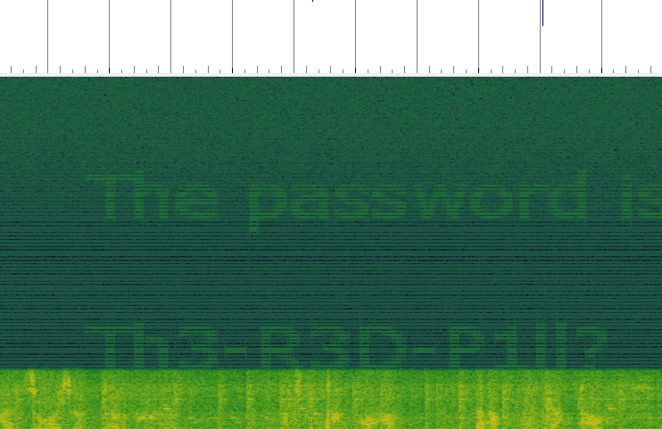

# Matrix

## Information
Category: Stegano   
Difficulty: Hard   
Author: explo1t   
First Blood: BoredPerson   
Description:   
Thｉs is ｙouｒ last chaｎcｅ. Afｔｅr this, there is no turning back. You take the blue pill, the story ends, you wake up in your bed and believe whatever
you want to believe.  You take the red pill, you stay in Wonderland, and I show you how deep the rabbit hole goes. Remember, all I'm offering is the flag.
Nothing more.    

## Solution

Examining the supplied mp3 file in the sonic visualizer, we can quickly recover a password using the the spectogram.   

 `Th3-R3D-P1ll?`

 We conclude that it must be a password, that extracts a hidden file embedded in the mp3 file. Using this password and steghide, we can extract an image.   

 Our first instinct here should always be to find the original image as our has very likely been tampered with. We can do so using Google Reverse image search or Tineye.   

 And we successfully found the original!   

 

 Ok, so they dont really look any different, right? Well to exactly find out we can use GIMP!   

 

 Decoding that binary message gives us a the following password:  
 
 `n!C3_PW?`
 
 Using Steghide here doesn't work anymore, but with binwalk, an encrypted 7z archive comes to our attention.  
 
 We supply the password to the password prompt and get a file called secret.txt. Its contents are:   

 `6W6?BHW,#BB/FK[?VN@u2e>m8`
 
 At this moment, we could try to repeatetly apply any encoding or decryption method on this string, or we can just use a tool that automates this task for us:
 
 https://scwf.dima.ninja/

 and we get the flag: `CSCG{St3g4n0_M4s7eR}`

 Apperently, the string was the base85 representation of the flag.

 ## Prevention

 If we wish to truly like to send a secret message such that it is unnoticed, we could just use steghide with a presettled strong password.