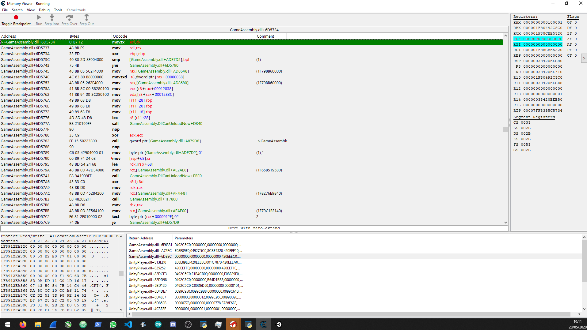
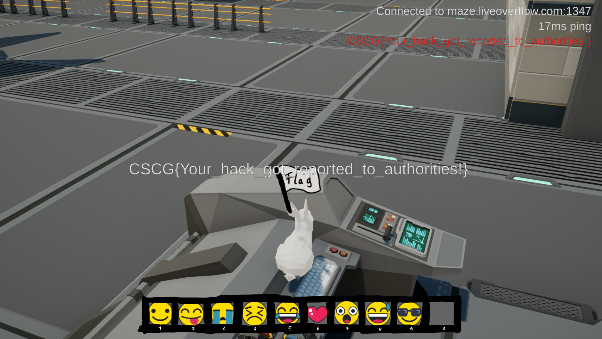

# Maze - Emoji

## Information
Category: Gamehax   
Difficulty: Easy   
Author: LiveOverflow   
First Blood: Nayos   
Descirption: Only real hackers can use secret emojis.

## Solution

As hinted, we need to be able to access emojis that we cant access from our keyboard keys. To find the function responsible for which emoji should be
send to the server, we can use Ghidra. The file, in which the game logic sits is `GameAssembly.dll`, so we need to import that one. But we quickly notice 
that we may have a hard time finding and reversing our function without symbols. Luckily, the dll at hand is actually a il2cpp dll which was shipped with 
symbol information. Il2pp is basically a tool that will turn IL bytecode into native x86-64. So we can get Il2cppDumper and run the ghidra.py script in Ghidra.
Now we have symbols, nice! Looking around, we find the method `ServerManager::sendEmoji()`, it is very likely the method we need. 

So now there are various ways to solve this, but I didn't have much time, so I went with the cheapest solution. This was getting the function's offset
and investigating it with CheatEngine. 

Through trial and error, I found some instruction at which the rdx register held some content that happend to change 
which emoji is sent off. I accomplished this by setting a hardware-breakpoint and then changing the respective register. Changing it a few times (I cant recall
which value) gave me the flag.

Honestly, this was a really muddy solution. but it worked. Alternatively, I cound have patched the method, but I guess that would have taken up too much
of my time. 
