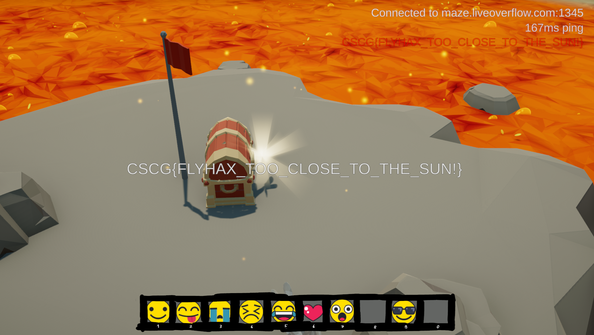

# Maze - The Floor Is Lava

## Information
Category: Gamehax   
Difficulty: Medium   
Author: LiveOverflow   
First Blood: Nayos   
Description:   
Reach the chest surrounded by dangerous lava.

## Solution

This challange involves a fly-hack to not step on the lava and die. Using CheatEngine, we try to find the variable responsible for the rabbits height.
I accomplished this by using the stacked boxes right next to the spawn location. Having found the respective address, we can climb up the boxes again 
and patch the instructions that write to that address with a nop instruction. If we now leave the stacked boxes, we hover in the air!!!
Since we have unlocked the lava-location from the last challange, we can just teleport us there and hover to the chest, without touching the lava.

flag: CSCG{FLYHAX_TOO_CLOSE_TO_THE_SUN!}

## Prevention 

The server could also check whether the physics of its clients reported coordinates are valid.