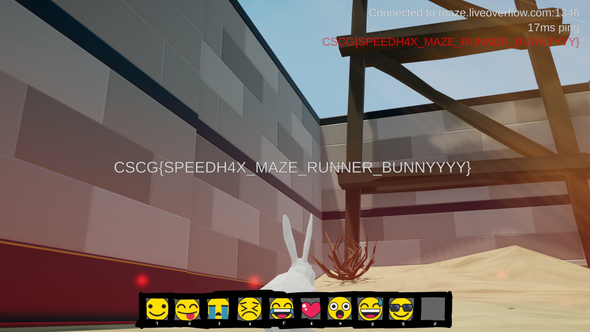

# Maze - Maze Runner

## Information
Category: Gamehax   
Difficulty: Medium   
Author: LiveOverflow   
First Blood: DeeJayBro   
Description:   
Can you complete the scorch trials?

## Solution

Trying to reach the circles in time and failing clearly lets us consider a speed hack. We can now start to extend our game interface that I roughly explained in the maze-tower
writeup. Up until now, we can use it to glitch and read out the rabbits horizontal position. Building on that, we can add a small functionality that increases the player's 
speed. 

```c++
else if (strcmp(cmd, "iamspeed\n")==0) {
			float oldx1 = 0;
			float oldx2 = 0;
			float nowx1 = 0;
			float nowx2 = 0;

			for (int x = 0; x < SpeedDuration; x++) {
				oldx1 = (*x1);
				oldx2 = (*x2);
				std::this_thread::sleep_for(std::chrono::microseconds(Boostpause));
				nowx1 = (*x1);
				nowx2 = (*x2);
				if (nowx1 > oldx1) {
					(*x1) += (nowx1-oldx1)* (float)BoostFactor;
				}
				else if (nowx1 < oldx1) {
					(*x1) -= (oldx1-nowx1)* (float)BoostFactor;
				}
				if (nowx2 > oldx2) {
					(*x2) += (nowx2-oldx2)* (float)BoostFactor;
				}
				else if (nowx2 < oldx2) {
					(*x2) -= (oldx2-nowx2)* (float)BoostFactor;
				}
			}
		}
```

This switch case contains a loop, that records the player's coordinate at two shifted times. The difference of the old and new vector components is then magnified using simple 
multiplication. The result is then added or substracted, depending on whether the new value is greater or smaller.

I also added functionality to the interface to configure `BoostFactor`, `Boostpause` and `SpeedDuration` to eliminate the need to recompile the dll 
everytime there I wanted to tweak them. 

One strange thing I noticed was that my pointer paths gradually stopped working with the success rate going down.

Anyway, using this cheat, I was able to get to the last circle!




Console Interaction:


flag: CSCG{SPEEDH4X_MAZE_RUNNER_BUNNYYYY}

## Prevention

Again, it is up to the server to make sure its client's reported positions comply with the intended game logic.