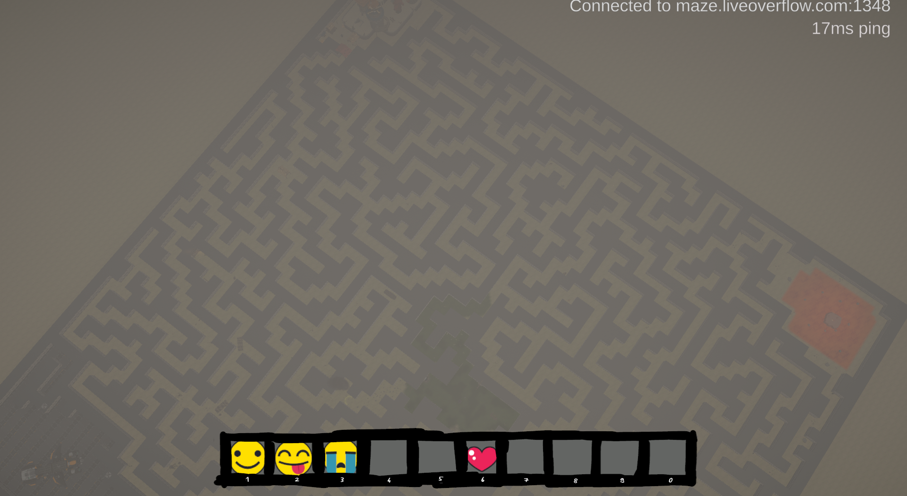
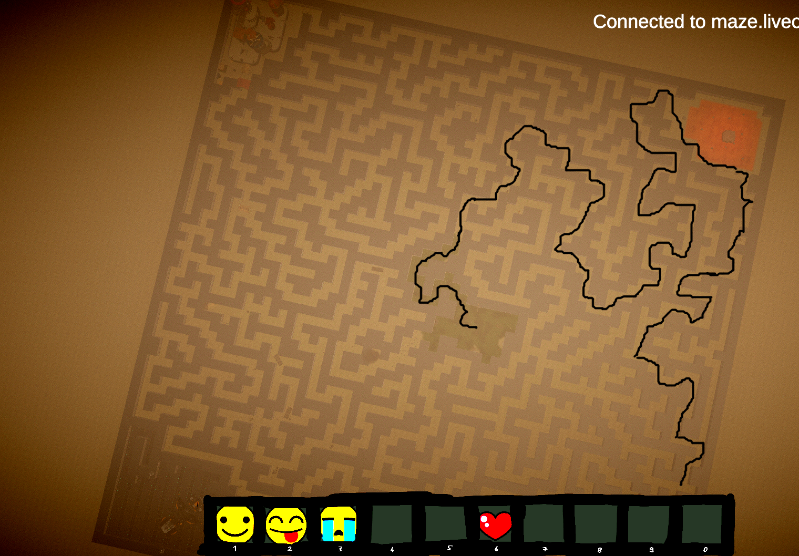
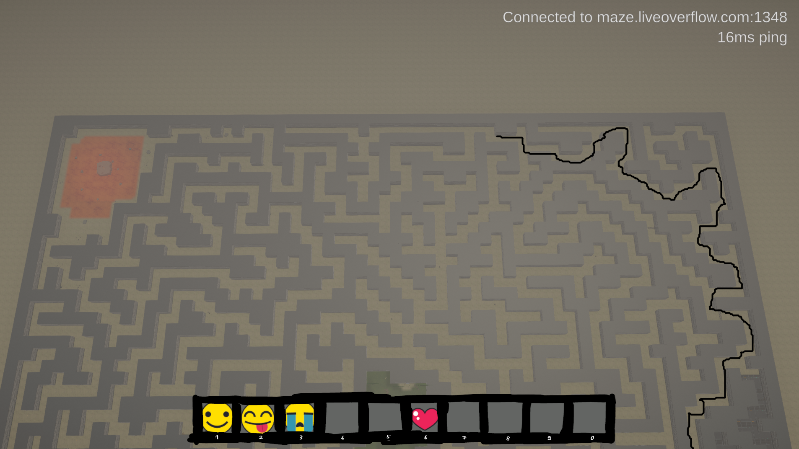
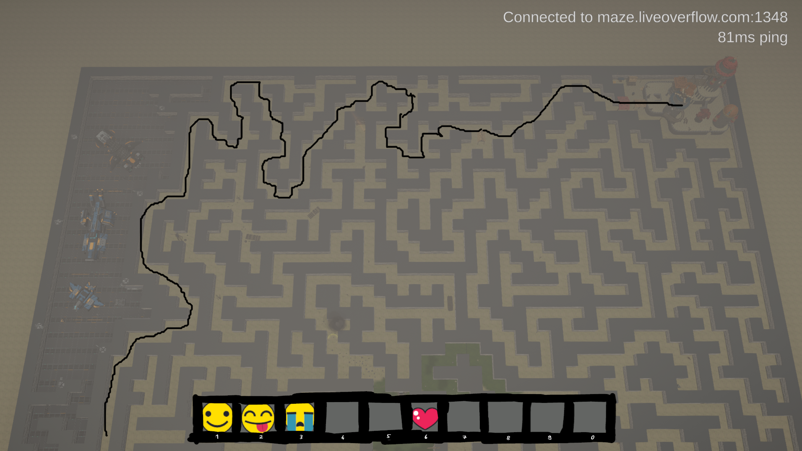
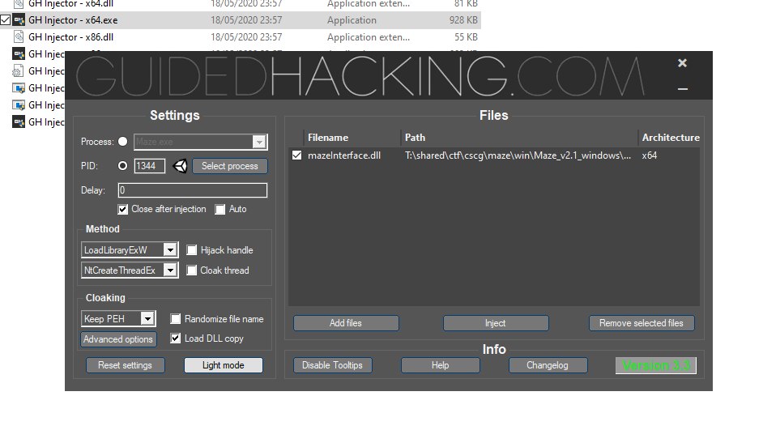
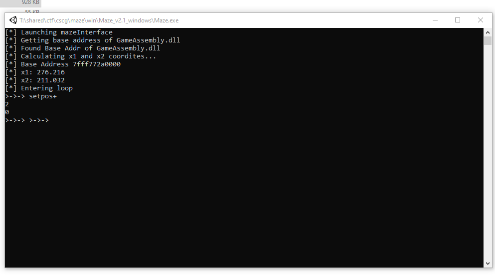
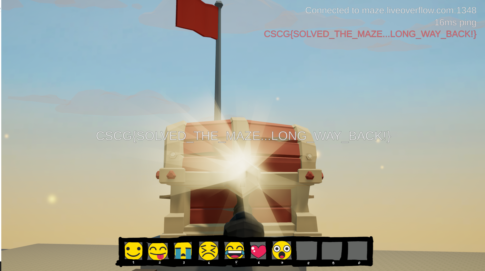

# Maze - Tower

## Information
Category: Gamehax   
Difficulty: Easy    
Author: LiveOverflow    
First Blood: Nayos    
Description:   
Find a path to reach the tower and climb to the top.

## Solution

As opposed to the first game, this one connects to a game server. The name and description suggests, we are placed in the middle of maze and need 
to find a path to a tower. Again, we launch CheatEngine to find the values for the player coordinates. This time, we also do a pointer scan to not 
need to redo everything again when relaunching. Finding the x and y coordinate should be enough to let us teleport around, right???. While changing 
the values in CheatEngine does work, it is only effective for small distances. It also does not have any effect when the player coordinates are set to a location behind 
a wall. My assumption at this point was the following: The server carefully tracks every player object and only allows movement that complies with its logic. Since the 
flags or the keys for the flags are sent over by the server, it doesn't help us when we patch the game such that we are free to move wherever we want.

The camera, however, is part of the unity player and plays no role in the game logic. Applying our usual filtering on the camera movement, we actually found
the variable that controls the height!!!

To take the following screenshots, I needed to patch an instruction that frequently updated it.



Now, there is probably a much more elegant way to get the full map, but I just went with taking a few screenshots and then trying to find a path manually.








Yes, that was not the quickest way, but I also wanted to take a look into the other sites. What I could have done up to this point was to get my first speed hack ready as I have written a small console based hacking interface that I could extend with features over time. But at that moment, the only thing my interface could do was glitch into a specified direction and read out the players position. The interface is a dll and needs to be injected into the game process. I used Guided Hacking's injector for this.




Because the source code will still be modified and improved in the future of writing this writeup, I will now only be explaining its core functionality and 
uses regarding this challange.

The interface makes use of the fact that any loaded dll will have its dllMain Function called. A switch case in that function decides which code should handle
the reason for its call. We abuse this to start our own thread in the games process, giving us access to the process's memory. 

```c++
BOOL APIENTRY DllMain( HMODULE hModule,
                       DWORD  ul_reason_for_call,
                       LPVOID lpReserved
                     )
{
    switch (ul_reason_for_call)
    {
    case DLL_PROCESS_ATTACH:
        MakeThread();
        break;
    case DLL_THREAD_ATTACH:
        break;
    case DLL_THREAD_DETACH:
        break;
    case DLL_PROCESS_DETACH:
        break;
    }
    return TRUE;
```


Having done a pointer scan in CheatEngine for the variables that we are interested in, we can find stable pointer paths that should always point to our respective variables. This is to bypass the difficulty of finding variables located on the heap. 

In `MakeThread()`, a thread is created that will spawn our console.




Using the command `setpos+`, I can specify in what direction the rabbit should 
be glitching into.The '+' simply denotes that the input figures will be _added_ to the player object coordinates. This command is frequently needed in the tower area and also at the beginning, when circumventing the high fence.

Code for `setpos+` :

```c++
else if (strcmp(cmd, "setpos+\n") == 0) {
			float plusx1;
			std::cin >> plusx1;
			float plusx2;
			std::cin >> plusx2;
			(*x1) += plusx1;
			(*x2) += plusx2;

		}
```
The variables x1 and x2 point to the memory location of the x and y coordinates.


Finally, after a long journey, we reach the chest with the flag!



flag: CSCG{SOLVED_THE_MAZE...LONG_WAY_BACK!}

## Prevention

There are few methods to implement that prevent the clients from hacking the unity camera, however the server logic can make sure
that clients comply with its physics, e.g no hovering or glitching.