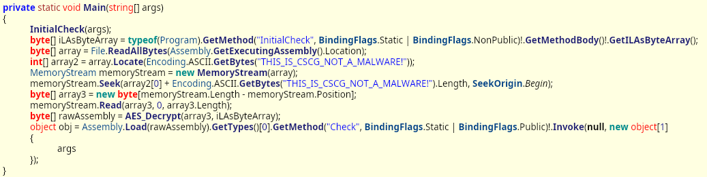
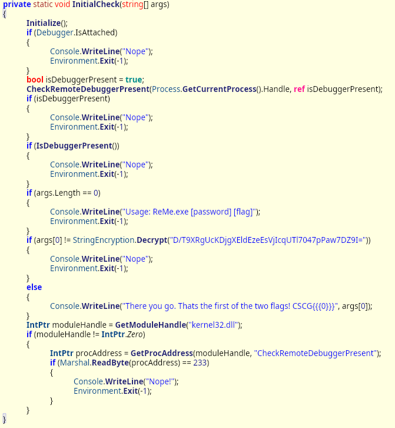

# reme 1

## Information
Category: Reverse Engineering   
Difficulty: Easy   
Author: 0x4d5a   
First Blood: paul70011   
Description:   
.NET Reversing can't be that hard, right? But I've got some twists waiting for you 😈

Execute with .NET Core Runtime 2.2 with windows, e.g. dotnet ReMe.dll

## Solution

Executing the provided dll tells us that a password should be provided as argument, but we don't have password. 
Viewing ReMe.dll in dnSpy, we see that in the main method, InitialCheck() is first called with parameter that was passed via Main().

Inspecting InitialCheck(), we see that it compares the first element of its parameter to the return value of StringEncryption.Decrypt()

To retrieve the flag, we can write our own C# Program that invokes the same Method with the respective parameters and print the return value. Here, we just need to ensure that we correctly initialised our directory as dotnet project and included "StringEncryption.cs", which we can extract from dnSpy.

Running the above program with `dotnet run` gives us the password 

`CanIHazFlag?`

Executing ReMe.dll with that as first argument gives us the flag:

CSCG{CanIHazFlag?}
