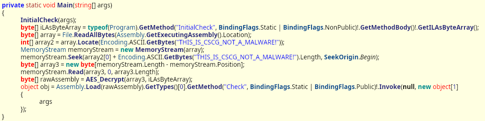

# reme 2

## Information
Category: Reverse Engineering   
Difficulty: Medium   
Author: 0x4d5a   
Dependencies: reme Part 1   
First Blood: localo   
Description:   
.NET Reversing can't be that hard, right? But I've got some twists waiting for you 😈

Execute with .NET Core Runtime

## Solution

Knowing about the solution for the last challange, we can have a closer look at the Main function in the C# code using IlSpy again. 



This code block basically takes the steps to decrypt an array of bytes in `ReMe.dll` that come after "THIS_IS_CSCG_NOT_A_MALWARE!".

The most important findings are:

1. The IL method body of InitialCheck is the password.
2. key and iv are derived from that password using Rfc2889 
3. The bytes after "THIS_IS_CSCG_NOT_A_MALWARE!" need to by decrypted via AES-CBC


To get key and and iv, we write our own C# program that is going to output those two for us, as I was not sure if there would be differences between
Rfc2889 and pbkdf2.  (I couldnt find Rfc2889 for python)

Here is the main method code

```C# 
static void Main(string[] args)
        {
            var pw = new byte[0x121];
            string filename_pw = "../pw.bin";
            Console.WriteLine("[test.exe] opening pw.bin ...");
            using (BinaryReader br = new BinaryReader(File.Open(filename_pw, FileMode.Open))) {
                pw = br.ReadBytes(0x121);
            }
           
          
            var salt = new byte[] {1,2,3,4,5,6,7,8};

			Console.WriteLine("[test.exe] deriving key with supplied file and salt");
            Rfc2898DeriveBytes pbkdf2 = new Rfc2898DeriveBytes(pw,salt,1000);
            var key = pbkdf2.GetBytes(32);
            var iv = pbkdf2.GetBytes(16);         

            using(BinaryWriter bw = new BinaryWriter(File.Open("../key.bin", FileMode.Create))) {
                Console.WriteLine("[test.exe] key.bin created");
				bw.Write(key);
            }

            using(BinaryWriter bw = new BinaryWriter(File.Open("../iv.bin", FileMode.Create))) {
				Console.WriteLine("[test.exe] iv.bin created");
                bw.Write(iv);
            }
        }
```
Running the program gives us the iv and key. We can now incoperate this into a python script that will do the actual decryption.

```python
#!/usr/bin/python
from Crypto.Cipher import AES

key = open("key.bin", "rb").read()[:32]
iv = open("iv.bin", "rb").read()[:16]
data = open("encrypted_data.bin", "rb").read()

decrypted = []
cipher = AES.new(key, AES.MODE_CBC, iv)
decrypted = cipher.decrypt(data)
open("decrypted_data.bin", "wb").write(decrypted)
```

We now decrypted the encrypted data chunk that was appended to `Reme.dll`!
As we can view it in IlSpy, it also a dotnet program. We take the same steps as in Reme Part 1.
Apperently, the user most provide 7 arguments for the flag to be printed. Cracking the one hash gives us the full flag:

CSCG{n0w_u_know_st4t1c_and_dynamic_dotNet_R3333}

## Prevention

Obfuscation is harder in .NET, so if we wish to obfuscate better, we should use native programming languages.