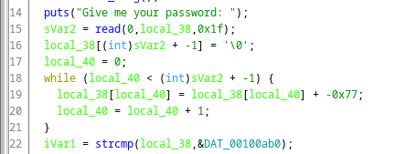

# Intro to Reversing 2

## Information
Category: Reverse Engineering   
Difficulty: Baby   
Author: 0x4d5a   
Dependencies: Intro to Reversing 1   
First Blood: BoredPerson   

## Solution

This time, we can't pull anything useful from strings, as opposed to before. However we can use a reversing tool such as Ghidra to look at the decompiled pseudo C-code 
in order to understand what the program is doing. In Ghidra, we can observe that in fact, that every character of our input is decremented by 0x77. 





The result is then 
compared to a different string, which is some binary array in the .rodata section. Having some pro hacker intuition where this is going, we write our own C code that
is going to hook strcmp() via LD_PRELOAD. 

```c
int strcmp(char * str1, char * str2) {
	printf(str1);
	printf(str2);
	exit(1);
}
```
We have to compile the C file with the -shared and -c argument for the function to be exported, and mark it as not executable.

The "new" strcmp() prints both strings to be compared to standard output. Doing it this way might be not be the quickest approach, but it lets us easily visualize how our input is changed and what its final state has to be to pass.

Now we can asses the string transformation that is taking place in the code before the compare. The following python code reverses the static transformation.   
We just had to dump our findings for the second argument in strcmp() in a file.   

```python
#!/usr/bin/python2

def convert77(text):
	print("Read in...:")
	new = ""
	for x in text:
		new += chr( (ord(x) + 0x77) % 256)
	new += '\n'
	return new
    

def main():
	print("starting...")
	text = open("../translation/hash.bin", "r").read()
	text = convert77(text)
	print(text)
	open("pw.bin", "w").write(text)


main()

```

We launch our script and get: sta71c_tr4n5f0rm4710n_it_is

That sounds like a good ctf passphrase, so we try it on the binary without the strcmp() hook and succesfully pass. 

Connecting to the actual server, we get the flag: CSCG{1s_th4t_wh4t_they_c4ll_on3way_transf0rmati0n?}


## Prevention

Using strong hashing algorithms such as bcrypt for verification would resolve the issue at hand.