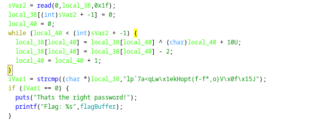

# Intro to Reversing 3

## Information
Category: Reverse Engineering   
Difficulty: Baby   
Author: 0x4d5a   
Dependencies: Intro to Reversing 2   
First Blood: BoredPerson   

## Solution

Intuitively, we can assume that this time, the decompiled pseudo code will be a little bit harder to interpret. So the first thing 
we can do is open the binary in ghidra. As last time, we find the main function and focus on what happens to the variable initalized 
by a read libcall up to when it is compared to some data via strcmp(). 




We notice that, again every byte is looped over. But this time, it is xored  with the its current index plus 10 and the substracted by two. Knowing the bytearray that has to come out at the end, we can already start coding our reverse implementation of the algorithm. 

```python
#!/usr/bin/python

hash  = \
0x6c, 0x70, \
0x60, 0x37, \
0x61, 0x3c, \
0x71, 0x4c, \
0x77, 0x1e, \
0x6b, 0x48, \
0x6f, 0x70, \
0x74, 0x28, \
0x66, 0x2d, \
0x66, 0x2a, \
0x2c, 0x6f, \
0x7d, 0x56, \
0x0f, 0x15, \
0x4a, \

```

Next, we simply mathematically reverse the algorithm for each byte:

```python
# reverse logic
i = 0
orig = ""
temp = 0

while i<27:
    temp = hash[i]
    temp+=2
    temp^=(i+10)
    orig += chr( temp%256 ) 
    i += 1
    
print(orig)
open("pw.txt", "w").write(orig)

```

and we get the flag: CSCG{pass_1_g3ts_a_x0r_p4ss_2_g3ts_a_x0r_EVERYBODY_GETS_A_X0R}


## Prevention

Using strong hashing algorithms such as bcrypt for verification would resolve the issue at hand.