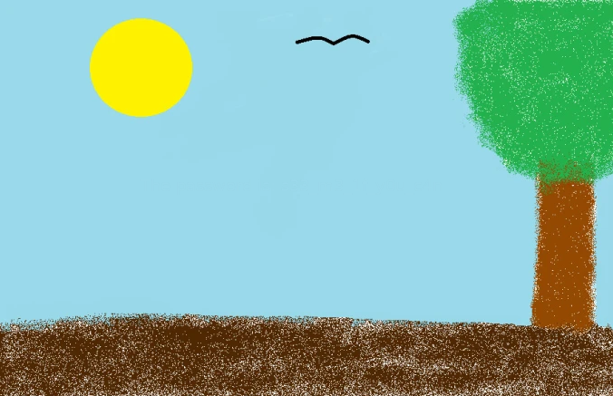
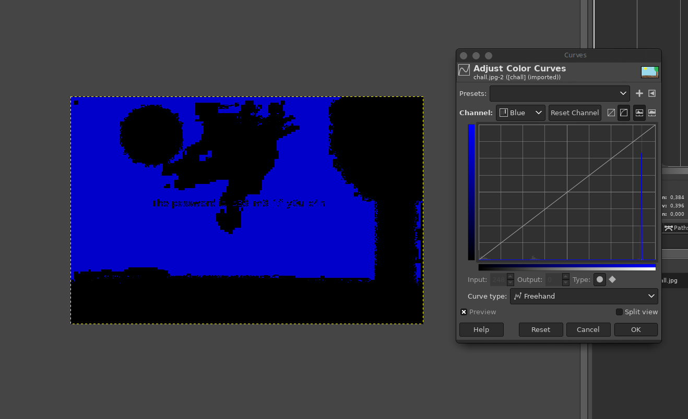

# Intro to Stegano 3

## Information
Category: Stegano   
Difficulty: Baby   
Author: explo1t   
First Blood: Kevin   

## Solution

The file can be closer analyzed in GIMP. Playing with the colour levels, we can that the image contains a hidden password:

`s33_m3_1f_y0u_c4n`

That looks like a password. Using steghide with that password does not work,
but apperently there is an embedded 7z password encrypted archive in the PNG file. Extracting and trying to unlock it successfully recovers the flag for the 
challange!

CSCG{H1dden_1n_pla1n_s1ght}

## Prevention

If we wish to truly like to send a secret message such that it is unnoticed, we could just use steghide with a pre-settled strong password.