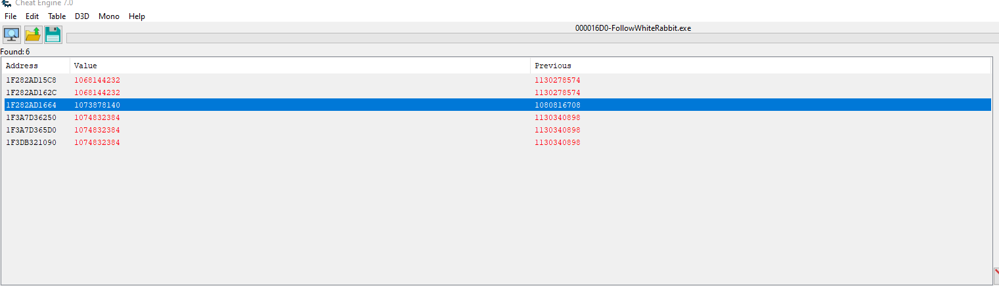
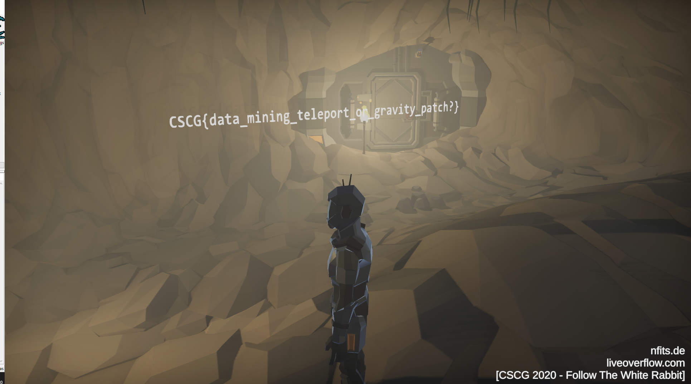

# Follow The White Rabbit - Cave

## Information
Category: Gamehax   
Difficulty: Easy   
Author: LiveOverflow   
First Blood: localo   
Descripion:   
Follow the white rabbit... into the hole.https://www.youtube.com/watch?v=IhLBamqn_5Q 


## Solution

Actually following the rabbit into the hole kills us due to the impact from falling, so we need to find the z coordinate for the 
game object we are controlling (or is it the camera object? I am not sure...). For this, we can use CheatEngine. It is a tool that 
takes the challange of finding game variables by its behavior, e.g. a z coordinate would increase when the respective object is 
moved higher. Repeatetly doing so is actually very effective and lets the user quickly filter out all unimportant addresses.



It was relativly easy to find all variables that are directly affected by moving higher or lower, however we also need to ensure we tweak the source variable. After finding it, we deliberately fall into the hole and die to see on what integer we need to set the source variable in order to teleport "safely" into the dungeon. 

I came about the following integers: 

```txt
on the hill: 1082707323
in the dungeon: 1075111810
```

Going on the hill and changing the source variable for the Z coordinate safely teleports us into the dungeon. From there, we just have to walk a bit further until we reach the flag!



flag: CSCG{data_mining_teleport_or_gravity_patch?}


## Prevention

In online games, the server can check if its clients reported positions are valid. Offline, I don't think there is much you can do to prevent this.