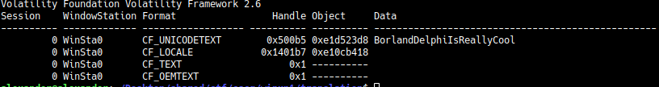

# win_eXPerience 1

## Information
Category: Misc   
Difficulty: Easy   
Author: TheVamp   
First Blood: pluxtore   
Description:   
R3m3mb3r th3 g00d 0ld 1337 d4y5, wh3r3 3ncrypt10n t00l5 4r3 u53d, wh1ch 4r3 d34d t0d4y 4nd r3c0mm3nd b1tl0ck3r. H4v3 fun t0 f1nd th15 5m4ll g3m 1n th3 m3m0ry dump.    

## Solution

When we have a memory dump, we can run various recovering tools on it to recover files that were cached in memory. Here, I used foremost
and found a suspicious encrypted zip file. Opening it requires a password, so we start using volatility to start analyzing the system for the password.
As hinted, the memory dump is from a Windows XP running machine. Using `volatility -f memory.dmp clipboard`, we finally found a something that
looks like a password! 

`BorlandDelphiIsReallyCool`

Combining that password with our previous finding, we sucessfully extract the flag:

CSCG{c4ch3d_p455w0rd_fr0m_0p3n_tru3_cryp1_c0nt41n3r5}

## Prevention

To prevent this you should not keep password in your clipboard for too long.