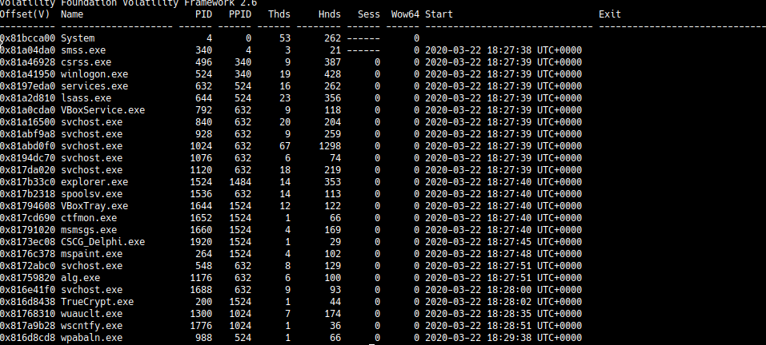

# win_eXPerience 2

## Information
Category: Misc   
Difficulty: Medium   
Author: TheVamp   
First Blood: localo   
Description:      
R3m3mb3r th3 g00d 0ld 1337 d4y5, wh3r3 cr4ckm35 4r3 wr1tt3n 1n l4ngu4g35, wh1ch 4r3 d34d t0d4y. H4v3 fun t0 f1nd th15 5m4ll g3m 1n th3 m3m0ry dump. 


## Solution

As hinted, we need to find a crackme in the memory dump. Assuming that it was a running process, we use `volatility -f memory.dmp pslist`
and get all running processes during time of the snapshot printed out.




We immediately notice the process CSCG_Delphi.exe and dump it via   
`volatility -f memory.dmp procdump --dump-dir dumpdir`

Lets run strings on that file and find this section specifically interesting:

```txt
TIdReadMemoryStream
TIdHashMessageDigest
TIdHashMessageDigest4
TIdHashMessageDigest5
1EFC99B6046A0F2C7E8C7EF9DC416323
25DB3350B38953836C36DFB359DB4E27
C129BD7796F23B97DF994576448CAA23
40A00CA65772D7D102BB03C3A83B1F91
017EFBC5B1D3FB2D4BE8A431FA6D6258
That is the correct flag
Looks like the wrong flag -.-
```

Intuitively, we can conclude that the flag must represented by those hashes. 
Cracking and appending them gives us the following string:

```
1hp13d!3ml00hcskc4rcdl0
```

Lets use our brilliant tool from Matrix to make sense of it!

So apperently, the hashes represent words in reverse character order

```
0ld cr4ck sch00l m3! d31ph1
```

To be honest, here i was really stupid. Although I knew that the flag was somehow created by those words, it took me more than two days to actually come to think about ```0ld sch00l d31ph1 cr4ck m3!```. During that time, I started to look into the reversed pseudo code in IDA and Ghidra. It was also hard to test a specific string because the PE would just not execute on my Windows machine.

Anyway, that is the flag:  CSCG{0ld_sch00l_d31ph1_cr4ck_m3!}

## Prevention

Crackme authors should choose stronger hashing algorithms, preferrably bcrypt with 100000 iterations. 

